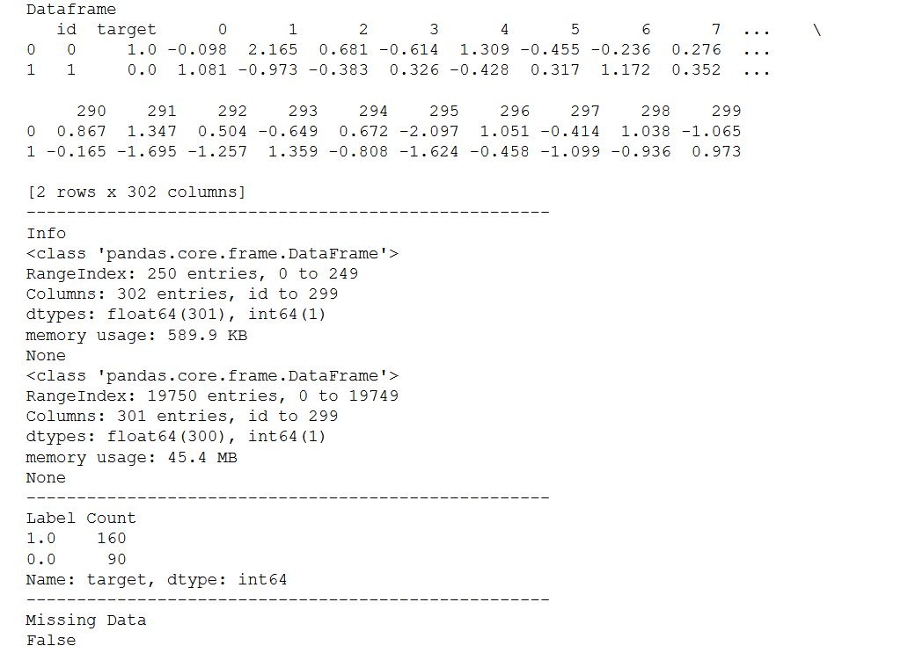
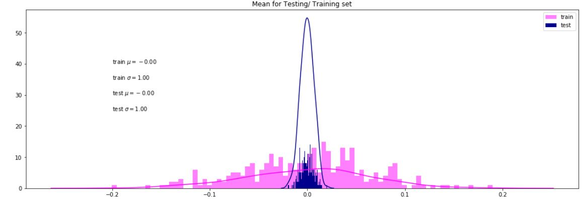
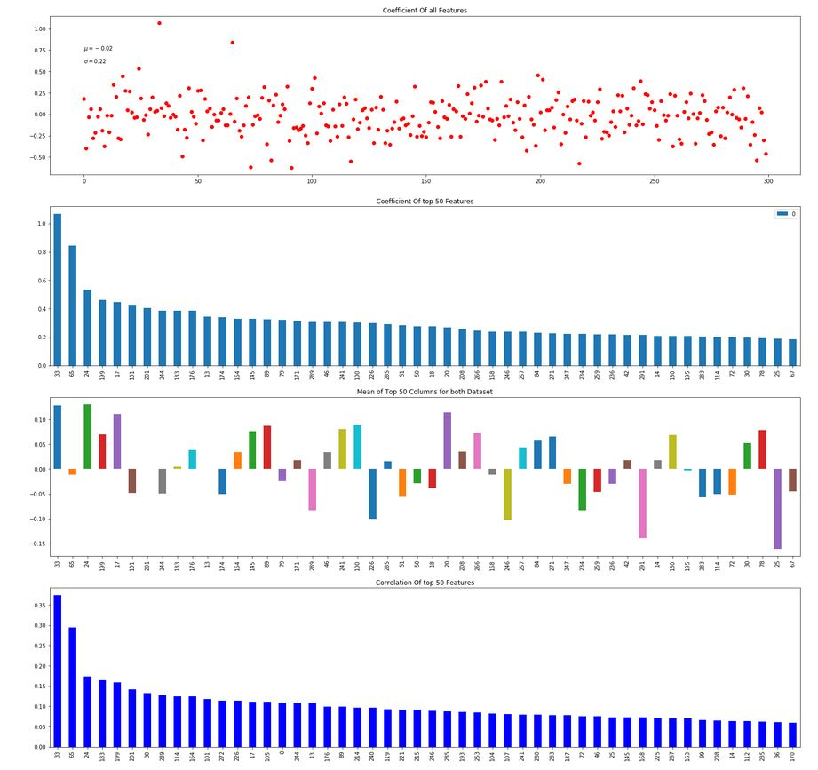
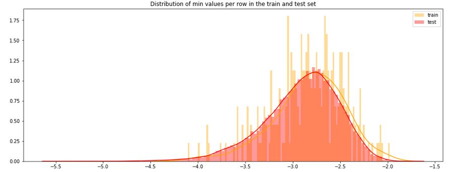
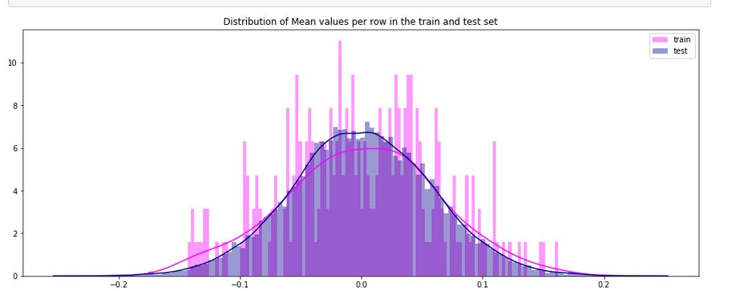
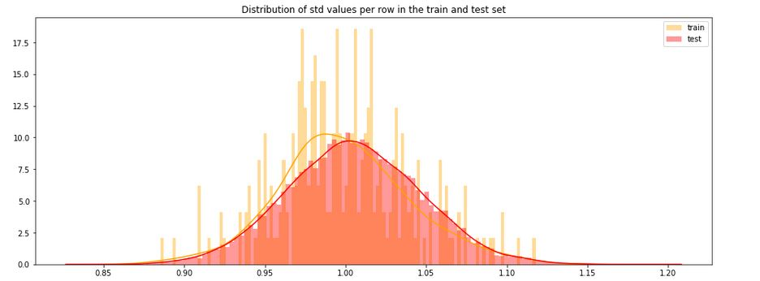
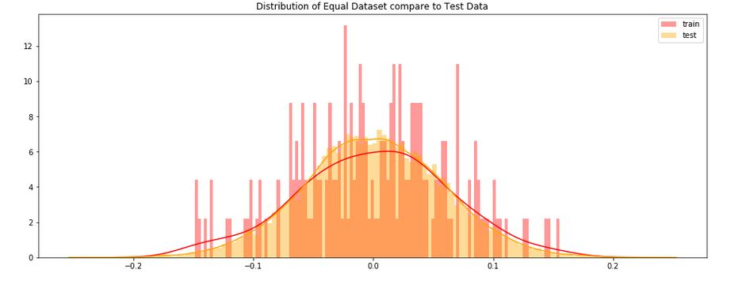

<h1>Kaggle Competition to avoid overfitting</h2>

This report is the process that was untaken to create the model that was entered into the Kaggle competition,"Don't Overfit".The premise of the competition is stated below :

    "we have 20,000 rows of continuous variables, and a mere handful of training samples. Once again, we challenge you not to overfit. Do your best, model without overfitting, and add, perhaps, to your own legend."

The basic structure of this report will consist of :
<ul>
  <li>Exploratory Data Analysis</li>
    <li>Exploring the Features Correlation</li>
    <li>Creating a scoring function</li>
    <li>Basic Modelling</li>
    <li>Experimenting with the model - Feature selection</li>
  </ul>

<h2>Exploratory Data Analysis</h2>

From an initial look, we can see the following information :
<ul>
    <li>Dataset contains Interval Data.</li>
    <li>It has 300 features and only 250 records</li>
    <li>There is an imbalance in the classification of 16/25</li>
    <li>There is no missing Data</li>
 </ul>

The information below shows example records of the dataframe, a brief description of the dataframe , the balance of the binary classifications and any missing data.

The graph below shows the Std and mean of the dataframe.

You can see that there has been some distortion to the train data, so even though it has the same mean and std as the train dataset, the scale is not the same. To fix this issue,the sklearn standard scaler was used to put both datasets on the same scale. As the data has a normal distributed within each feature, the scale will distribute the data around 0, with a standard deviation of 1.

To do this, the mean and standard deviation are calculated for the feature and then the feature is scaled based on: x(i)–mean(x) / stdev(x)

After looking at the mean and std, a graph was made to examine the coefficient and correlation for each feature.

 

The report will now examine the train dataset vs the test dataset in greater depth.

The min KDE for the train dataset is slighly skewed right when compared to the test dataset.

The mean's KDE for train and test dataset is slightly different with the test dataset having a taller distribution.

Again, there are differences in the std KDE between the train and test dataset with the train test being skewed to the right. One factor that could explain this difference is the bias in the dataset. As there are many more positive targets than negatives ones, this could explain the differences in the train/ test dataset if the test dataset had a 50-50% split.

When the data that had a 50-50% split was compared to the test dataset, it showed a difference between the two dataset.
This shows the biggest problem that we face. If we reduce the variance in our training dataset then the model will overfit, as the training and test data has a big enough differences to predict high acc and roc scores on the training data but not on the test dataset.

