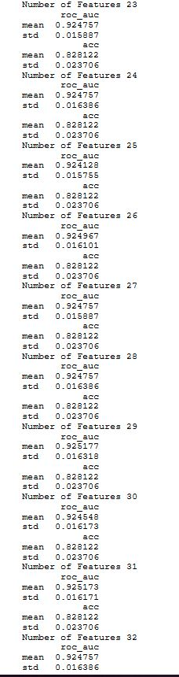

<h1>Kaggle Competition to avoid overfitting</h2>

This report is the process that was untaken to create the model that was entered into the Kaggle competition,"Don't Overfit".The premise of the competition is stated below :

    "we have 20,000 rows of continuous variables, and a mere handful of training samples. Once again, we challenge you not to overfit. Do your best, model without overfitting, and add, perhaps, to your own legend."

The basic structure of this report will consist of :
<ul>
  <li>Exploratory Data Analysis</li>
    <li>Exploring the Features Correlation</li>
    <li>Creating a scoring function</li>
    <li>Basic Modelling</li>
    <li>Experimenting with the model - Feature selection</li>
  </ul>

<h2>Step 1 - Exploratory Data Analysis</h2>

From an initial look, we can see the following information :
<ul>
    <li>Dataset contains Interval Data.</li>
    <li>It has 300 features and only 250 records</li>
    <li>There is an imbalance in the classification of 16/25</li>
    <li>There is no missing Data</li>
 </ul>

The information below shows example records of the dataframe, a brief description of the dataframe , the balance of the binary classifications and any missing data.

The graph below shows the Std and mean of the dataframe.

You can see that there has been some distortion to the train data, so even though it has the same mean and std as the train dataset, the scale is not the same. To fix this issue,the sklearn standard scaler was used to put both datasets on the same scale. As the data has a normal distributed within each feature, the scale will distribute the data around 0, with a standard deviation of 1.

To do this, the mean and standard deviation are calculated for the feature and then the feature is scaled based on: x(i)–mean(x) / stdev(x)

After looking at the mean and std, a graph was made to examine the coefficient and correlation for each feature.

 

The report will now examine the train dataset vs the test dataset in greater depth.

The min KDE for the train dataset is slighly skewed right when compared to the test dataset.

The mean's KDE for train and test dataset is slightly different with the test dataset having a taller distribution.

Again, there are differences in the std KDE between the train and test dataset with the train test being skewed to the right. One factor that could explain this difference is the bias in the dataset. As there are many more positive targets than negatives ones, this could explain the differences in the train/ test dataset if the test dataset had a 50-50% split.

When the data that had a 50-50% split was compared to the test dataset, it showed a difference between the two dataset.
This shows the biggest problem that we face. If we reduce the variance in our training dataset then the model will overfit, as the training and test data has a big enough differences to predict high acc and roc scores on the training data but not on the test dataset.

<h2>Step 2- Creating the Cross validation Scoring Function</h2>

This can be seen in the python code in the "Overfitting.ipynb" file

<h2> Step 3- Optimising the Classifiers </h2> 

Due to the nature of the compeition, a binary classification competition, a Logestic Model was used to start the alogorithm exploration. A GridSearch was then performed on the Logistic Regression model to optimise the classifier.

The best parameters from the GridSearch were then used to make the first submission.

<h2> Feature Selection </h2>

There are a number of feature selection methods that could be used to select the features for our classifier. The Feature Selection methods that I used was : Recursive Feature Elimination.

This process obtains the importance of each feature and recursively drops the feature with the least coefficient or importance until it finds the selection with the best number of features.

PCA was not used as the correlation between variables was not deemed as strong or even moderate. This lacking of strength between correlations can be seen in the heatmap graph below.

As we can see that the ROC score ranges from 0.703 to 0.808. However, we need to consider the problem of overfitting to the training model. Based on the fact that :
<ul>
    <li>The coefficient has a mean of -0.02 and std of 0.22 </li>
    <li>The differences between the train and test dataset will make overfitting likely </li>
</ul>
A decicision was made to make the model simpler so that we try and reduce the bias and hopefully stop overfitting to our train dataset. These means we must reduce the number of features and then further tune the model so that we can make sure that we get the best bias-variance trade off that we can.

25 Variables were selected for the model. The variables the were selected can be seen below

An examination of the test and train once again occured to see the difference between the two dataset.

With the reduced features we can see that the width of the distributions are similar, which can help us tune our model and so increase our ROC score on both the training and testing dataset. The first method was to add new features to the data. A quick evaluation on the postive and negative targets took place.

As you can see that each of new the values show differences between the target values. Therefore, I will recursively eliminate the features see how they improve the ROC score.

This resulted in huge overfitting. From the initial graphs ,we can see that the std ditribution is more of a Gemma shape than a Gaussian one. This means that I will delete both the std and variance feature.This showed a slight improvement however overfitting was still occuring. The next step was to try and combine a few models to reduce this overfitting.

<h2> Making an Emsemble</h2>

The two approaches that were used was the BaggingClassifier and the VotingClassifier with the Votingclassifer offering better results on the test dataset.

Again, overfitting is occurring on the test data. The next step will be to do further research on how to avoid overfitting. I will investigate similar competitions and look at the process that the winners took to avoid overfitting with a high dimensional / low sample dataset.

